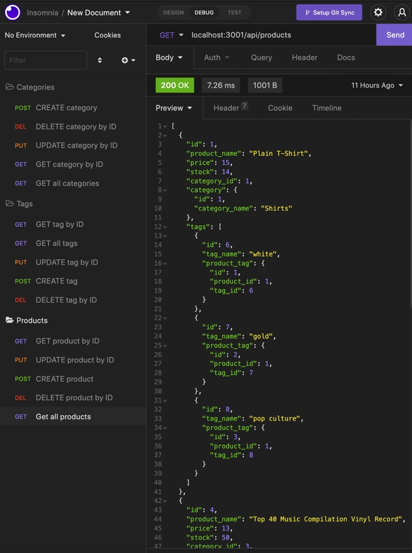

# E-commerce_be

## Table of Contents 
1. [Description](#description)
2.  [Visuals](#visuals)
3. [Resources](#resources)

## Author:

Justin Stone

## Description

This backend e-commerce data structure provides the user access to get, post, put and delete categories, tags and products allowing full access to edit the data how they would like. 

## Visuals

## Resources

[Repository](https://github.com/Justinstone2001/E-commerce_be)

[Video](https://www.youtube.com/watch?v=SaBOqOQZbdM)